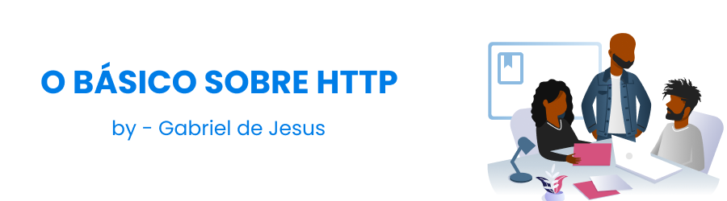

## O que é HTTP?

Quando se trata de HTTP, o primeiro pensamento que vem à mente é sobre como usar internet, é o cenário onde realmente vemos o uso do HTTP na prática. Nós acessamos sites onde seus endereços começam com http: // e, portanto, precisamos saber o que realmente está acontecendo ao fazer isso.

No momento em que você acessou este repositório, esta aula, entre o navegador e o Alura aconteceu comunicação, e essa comunicação tem duas partes bem conhecidas que chamamos
Cliente-Servidor ou em Português Cliente-Servidor. Este é um modelo arquitetônico, ou seja, o
Toda a internet é baseada nesta arquitetura onde há um cliente que solicita e um servidor que responde.

* Cliente (navegador como Chrome ou Firefox) -> Internet -> Servidor (usando PHP, JAVA ou NET entre outros) *

Em qualquer comunicação, deve haver algumas regras para que as duas partes possam
entender com sucesso. Pensando na comunicação do seu navegador entre Alura ou algum outro
site este conjunto de regras é basicamente um protocolo, onde neste cenário é HTTP.

Os protocolos são definidos, especificados e disponibilizados para implementação em
ambas as partes, para consultar a especificação HTTP, você pode usar o seguinte
endereço: https://tools.ietf.org/html/rfc2616

Cliente (navegador como Chrome ou Firefox) -> Regras de comunicação? -> Servidor (usando PHP, JAVA ou NET entre outros)

#### Resumindo:
* HTTP é um protocolo que define as regras de comunicação entre cliente e servidor na internet. *

#### Exemplo:
* Cliente (navegador como Chrome ou Firefox) -> HTTP (protocolo) -> Servidor (usando PHP, JAVA ou NET entre outros) *

## Módulos

### 01. O que é HTTP?

↪️ Na internet sempre existe um cliente e um servidor

↪️ Deve haver regras de comunicação entre o cliente e o servidor

↪️ As regras são definidas dentro de um protocolo

↪️ HTTP é o protocolo mais importante da internet

### 02. A web segura - HTTPS

↪️ Por padrão, os dados são trafegados como texto simples na web.

↪️ Somente com HTTPS a web é segura

↪️ O protocolo HTTPS nada mais é do que o protocolo HTTP mais uma camada adicional de segurança, TLS / SSL

↪️ O tipo de criptografia de chave pública / chave privada

↪️ O que são certificados digitais

↪️ Os certificados têm identidade e validade

↪️ As chaves públicas estão no certificado, a chave privada está apenas no servidor

↪️ O que é uma autoridade de certificação

↪️ O navegador usa a chave pública para criptografar os dados

### 03. Endereços em seu domínio

↪️ URL são os endereços da web

↪️ Um URL começa com o protocolo (por exemplo https: //) seguido pelo domínio (https://github.com)

↪️ Depois que o domínio pode vir a porta, se não estiver definida, a porta padrão deste protocolo é usada

↪️ Após o domínio: porta, o caminho para um recurso é especificado (/ devgabrieldejesus / http-basics)

↪️ Um recurso é algo concreto no aplicativo que queremos acessar

### 04. O cliente pergunta e o servidor responde

↪️ O protocolo HTTP segue o modelo Solicitação-Resposta

↪️ Sempre o cliente inicia a comunicação

↪️ Um pedido deve ter todas as informações para o servidor gerar a resposta

↪️ HTTP não tem estado, não guarda informações entre as solicitações

↪️ As plataformas de desenvolvimento usam sessões para armazenar informações entre as solicitações

### 05. Depurando a solicitação HTPP

↪️ Console de depuração

↪️ Método HTTP GET

↪️ Cabeçalho de resposta

↪️ Códigos de resposta (código de status)

### 06. Parâmetros de solicitação

↪️ Usado para definir os detalhes da pesquisa ou enviar dados do formulário

↪️ GET: os parâmetros ss são enviados na própria URL (usando [?] E concatenando com [&])

↪️ POST: os parâmetros são enviados no corpo da solicitação

↪️ HTTP️ Existem outros métodos HTTP como POST, DELETE, PUT

#### Resumo

↪️ OBTER: Receber dados (Parâmetros na URL)
 
↪️ POST: Enviar dados (parâmetros no corpo da solicitação)
 
↪️ DELETE: Remover um recurso
 
↪️ PUT / PATCH: Atualizar um recurso

### 07. Serviços da Web com REST

↪️ REST é um padrão arquitetônico para comunicações entre aplicativos

↪️ Aproveita a estrutura HTTP

↪️ Os recursos são definidos via URI

↪️ Operações com métodos HTTP (GET / POST / PUT / DELETE)

↪️ Cabeçalhos (Aceitar / Tipo de Conteúdo) são usados ​​para especificar representações (JSON, XML, ...)

### 💡 Para saber mais: tipos de dados

Em alguns cabeçalhos HTTP, devemos especificar algum formato. Os formatos são chamados na documentação dos tipos MIME. E na definição do cabeçalho usamos a seguinte estrutura: tipo / subtipo. Os tipos conhecidos são:

`texto, imagem, aplicativo, áudio e vídeo`

E alguns subtipos:

`text -> text / plain, text / html, text / css, text / javascript`

ʻImagem -> imagem / gif, imagem / png, imagem / jpeg`

ʻAudio -> audio / midi, audio / mpeg, audio / webm, audio / ogg, audio / wav`

`video -> video / mp4`

ʻApplication -> application / xml, application / pdf`

ʻOutros formatos aceitos: https: // developer.mozilla.org / en-US / docs / Web / HTTP / Basics_of_HTTP / MIME_types`

### 08. HTTP2 - Para uma web mais eficiente

HTTP / 2 (originalmente chamado de HTTP / 2.0) é uma revisão importante do protocolo de rede HTTP usado pela World Wide Web. Ele foi derivado do protocolo SPDY experimental anterior, originalmente desenvolvido pelo Google.
HTTP / 2 foi desenvolvido pelo Grupo de Trabalho HTTP (também chamado de httpbis, onde "bis" significa "segundo") da Força-Tarefa de Engenharia da Internet.
HTTP / 2 é a primeira nova versão de HTTP desde HTTP 1.1, padronizado no RFC 2068 em 1997.
O Grupo de Trabalho submeteu HTTP / 2 ao IESG para consideração como um padrão proposto em dezembro de 2014, e o IESG aprovou a publicação como um padrão proposto em 17 de fevereiro de 2015.
A especificação HTTP / 2 foi publicada como RFC 7540 em 14 de maio de 2015.

💡 Um pouco sobre HTTP2

↪️ Atua sobre o que já se conhece de HTTP

↪️ Cabeçalhos binários e de tablet (HPACK)

↪️ GZIP padrão em resposta

↪️ Multiplexação (solicitação e respostas são paralelas)

↪️ Cabeçalhos úteis (apenas enviamos cabeçalhos que mudam)

↪️ Serve-Push (ato do servidor enviar dados sem que o navegador tenha solicitado)

English

## What is HTTP ? 🤔 

When it comes to HTTP, the first thought that comes to mind is about using
internet, is the scenario where we really see the use of HTTP in practice. We access
sites where their addresses start with http: // and so we need to know what really
is happening when doing this.
The moment you accessed this course, this class, between the browser and Alura happened
communication, and this communication has two well-known parts that we call
Client-Server or in Portuguese Client-Server. This is an architectural model, that is, the
The entire internet is based on this architecture where there is a client that requests and a server that responds.

*Client (Browser like Chrome or Firefox) -> Internet -> Server (Using PHP, JAVA or NET among others)*

In any communication, there must be some rules for the two parties to be able to
successfully understand. Thinking about your browser communication between Alura or some other
site this set of rules is basically a protocol, where in this scenario is HTTP.

Protocols are defined, specified and made available for implementation in
both parties, to consult the HTTP specification, you can use the following
address: https://tools.ietf.org/html/rfc2616

Client (Browser like Chrome or Firefox) -> Communication rules? -> Server (Using PHP, JAVA or NET among others)

#### Summing up:
*HTTP is a protocol that defines the rules of communication between client and server on the internet.*

#### Example:
*Client (Browser like Chrome or Firefox) -> HTTP (protocol) -> Server (Using PHP, JAVA or NET among others)*

## Modules

### 01. What is HTTP?

↪️ On the internet there is always a client and a server

↪️ There must be communication rules between the client and the server

↪️ Rules are defined within a protocol

↪️ HTTP is the most important protocol on the internet

### 02. The secure web - HTTPS

↪️ By default, data is trafficked as plain text on the web.

↪️ Only with HTTPS the web is secure

↪️ The HTTPS protocol is nothing more than the HTTP protocol plus an additional layer of security, TLS / SSL

↪️ The type of public key / private key encryption

↪️ What are digital certificates

↪️ Certificates have identity and validity

↪️ Public keys are in the certificate, the private key is only on the server

↪️ What is a certification authority

↪️ The browser uses the public key to encrypt the data

### 03. Addresses under your domain

↪️ URL is the web addresses

↪️ A URL begins with the protocol (for example https: //) followed by the domain (https://github.com)

↪️ After the domain can come the port, if not defined, the standard port of this protocol is used

↪️ After the domain: port, the path to a resource is specified (/devgabrieldejesus/http-basics)

↪️ A resource is something concrete in the application that we want to access

### 04. The client asks and the server answers

↪️ The HTTP protocol follows the Request-Response model

↪️ Always the customer initiates communication

↪️ A request must have all the information for the server to generate the response

↪️ HTTP is stateless, does not keep information between requests

↪️ Development platforms use sessions to store information between request

### 05. Debugging the HTPP request

↪️ Debug console

↪️ HTTP GET Method

↪️ Response header

↪️ Response codes (Status Code)

### 06. Request parameters

↪️ Used to define survey details or submit form data

↪️ GET: ss parameters are sent in the URL itself (using [?] And concatenating with [&])

↪️ POST: parameters are sent in the request body

↪️ HTTP️ There are other HTTP methods like POST, DELETE, PUT

#### Summary

↪️ GET: Receive data (Parameters in the URL)
 
↪️ POST: Submit data (Parameters in the request body)
 
↪️ DELETE: Remove a resource
 
↪️ PUT / PATCH: Update a resource

### 07. Web services with REST

↪️ REST is an architectural standard for communications between applications

↪️ It takes advantage of the HTTP structure

↪️ Resources are defined via URI

↪️ Operations with HTTP methods (GET / POST / PUT / DELETE)

↪️ Headers (Accept / Content-Type) are used to specify representations (JSON, XML, ...)

### 💡 To learn more: data types

In some HTTP headers we must specify some format. The formats are called in the MIME types documentation. And in the definition of the header we use the following structure: type / subtype. Known types are:

`text, image, application, audio and video`

And some subtypes:

`text -> text / plain, text / html, text / css, text / javascript`

`image -> image / gif, image / png, image / jpeg`

`audio -> audio / midi, audio / mpeg, audio / webm, audio / ogg, audio / wav`

`video -> video / mp4`

`application -> application / xml, application / pdf`

`Other formats accepted: https: // developer.mozilla.org / en-US / docs / Web / HTTP / Basics_of_HTTP / MIME_types`

### 08. HTTP2 - For a more efficient web

HTTP / 2 (originally called HTTP / 2.0) is an important revision of the HTTP network protocol used by the World Wide Web. It was derived from the previous experimental SPDY protocol, originally developed by Google.
HTTP / 2 was developed by the HTTP Working Group (also called httpbis, where "bis" means "second") of the Internet Engineering Task Force.
HTTP / 2 is the first new version of HTTP since HTTP 1.1, standardized in RFC 2068 in 1997.
The Working Group submitted HTTP / 2 to the IESG for consideration as a Proposed Standard in December 2014, and the IESG approved the publication as a Proposed Standard on February 17, 2015.
The HTTP / 2 specification was published as RFC 7540 on May 14, 2015.

💡 A little about HTTP2

↪️ Acts on what is already known of HTTP

↪️ Binary and tablet headers (HPACK)

↪️ Standard GZIP in response

↪️ Multiplexing (Request and responses are parallel)

↪️ Headers Sateful (We only send headers that change)

↪️ Serve-Push (Act of the server sending data without the browser having asked)
